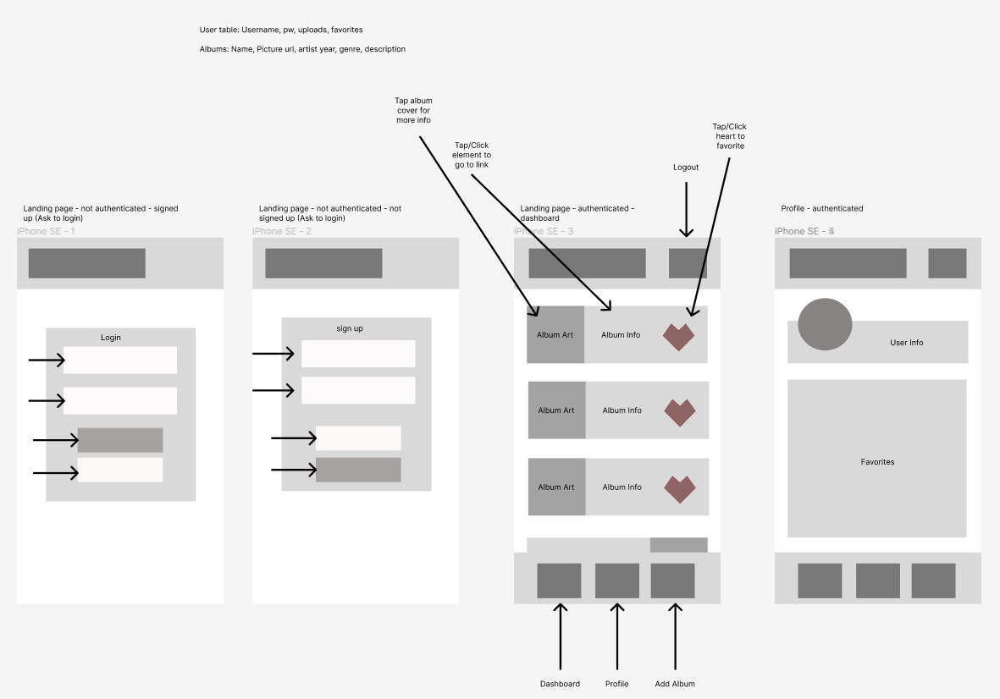
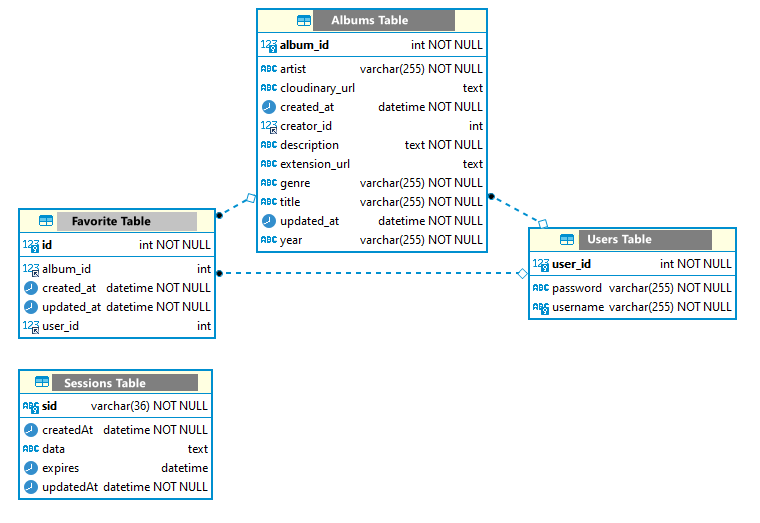
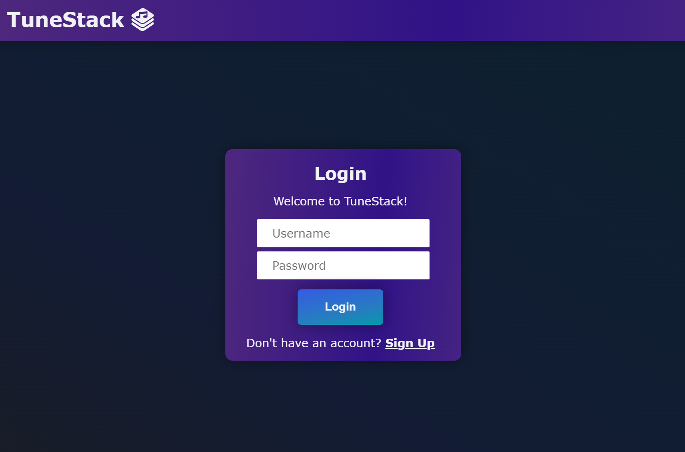
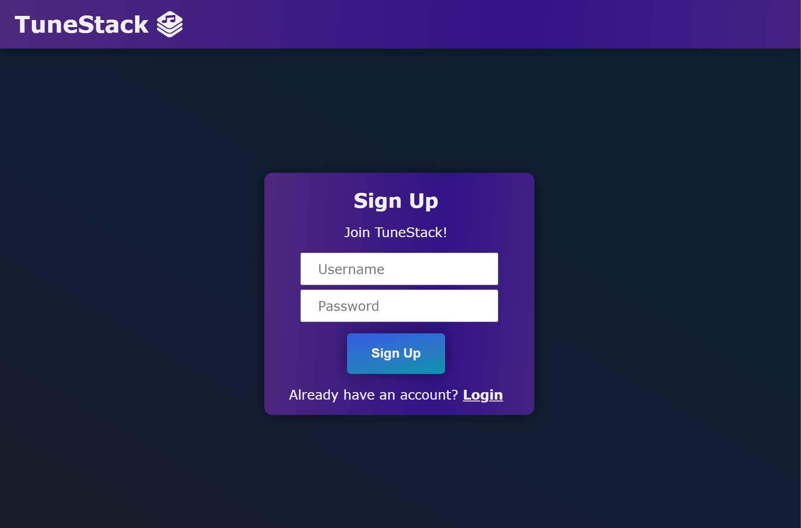

# TuneStack

[](https://tunestack-v1-74649ac6d540.herokuapp.com/)
[](https://github.com/jenho-webdev/TuneStack)
[](https://github.com/users/jenho-webdev/projects/7)
[](https://placeholder)


## Description

TuneStack web app is a web application that allows users to build a library of their favored music albums. Users can register, log in, and manage their album collection by adding their own albums or pin other existing albums they found on the web that created by others.

## Features

- User registration and authentication
- Add, delete, and view favorite albums
- User-friendly interface with interactive design
- Protecting routes to ensure secure user access

## Technologies Used

- Node.js
- Express.js
- Handlebars (with express-handlebars)
- Express-session
- Sequelize (with MySQL2)
- Bcrypt
- Dotenv
- Cloudinary (Images uploading widget and hosting)
- JAWS DB
- Heroku
- 

## Live Demo

Check out the live demo of the app: [](https://tunestack-v1-74649ac6d540.herokuapp.com/)
Presentation Slides: [](https://docs.google.com/presentation/d/1g0wAdp1-VNkJHB2Vd_clewWChCGXzdufYPJX2WoHx78/edit?usp=sharing)

Wireframe:


Database Relationship:


Login Page:


Sign up Page:


## Installation

1. Clone the repository:

   ```bash
   git clone https://github.com/jenho-webdev/TuneStack.git
   ```

2. Navigate to the project directory:

   ```bash
   cd your-repo-name
   ```

3. Install dependencies:

    ```bash
    npm install
    ```

4. Create a .env file in the root directory using the env.EXAMPLE provided in the root directory.

5. Start the application:

    ```bash
    npm start
    ```

6. Open your browser and visit ```<http://localhost:3000>``` to access the app.

## Deployment

[](https://tunestack-v1-74649ac6d540.herokuapp.com/)

## Current Contributors


Contributor Profiles:
[](https://github.com/cwchilvers)
[](https://github.com/saduhub)
[](https://github.com/jenho-webdev)
  
<!-- Add more contributors here -->

## Contributing

Contributions are welcome! If you find any bugs or have suggestions for improvements, please open an issue or submit a pull request.

## License

This project is licensed under the MIT License.

## Disclaimer

This web app is for educational and demonstration purposes only. The app may collect and store user information such as usernames, passwords, and other data for authentication and user account management purposes.

Please note that this project may not have undergone a thorough security audit and is not intended for production use without further review and enhancement of security measures.

The creators and contributors of this project are not liable for any damages, data breaches, or misuse of information that may arise from the use of this web app.

It is the responsibility of the deployer and users of this app to ensure proper security measures are implemented and that sensitive information is handled securely.

Always exercise caution when using this or any other web application that involves personal or sensitive data.