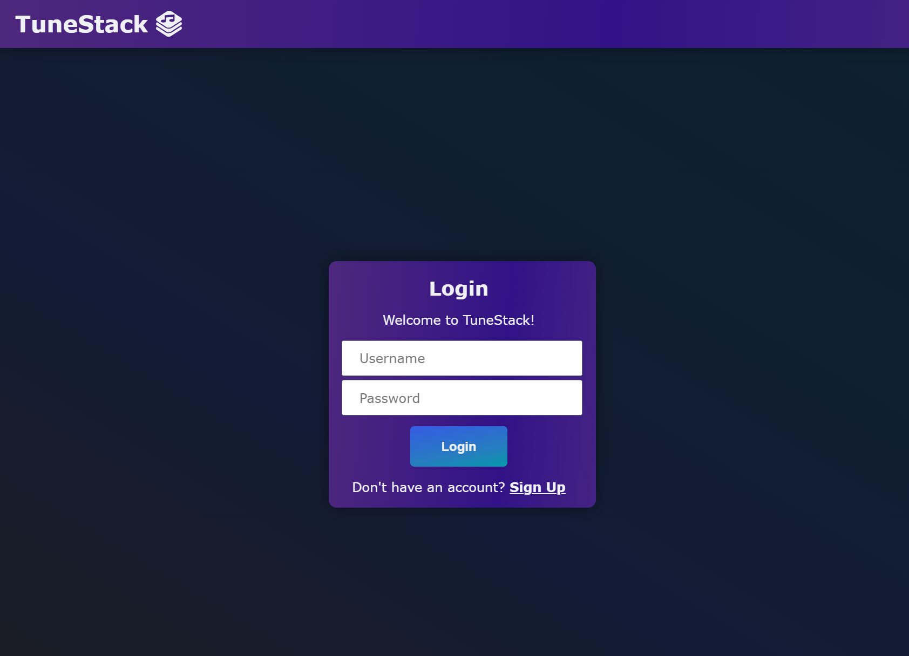

# TuneStack

## Description

TuneStack is a website designed allow users to share their favorite albums with other users and discover new music. Users can access their upload library as well as their favorited albums.  

In addition to the current functionality, we have exciting updates planned for the future of TuneStack. These include:

The primary motivation behind developing TuneStack was to facilitate collaborative learning and teamwork within our TuneStack team. By utilizing platforms like GitHub, GitHub Projects, and Slack, we honed our skills in working as part of a team for a project following the MVC paradigm. Most importantly, working asynchronously. Leveraging our collective knowledge of Handlebars, CSS, Javascript, Node, git, mysql, and sequelize, we aimed to create a modern and robust full-stack application. Throughout the development process, we gained valuable insights into controllers, authorization, security, and sessions. Integrating new technologies like uploadthing, as well as utilizing the the eslint and prettier, allowed the Tunestack team to successfully deploy this project.

Link to deployed application [here]()

Screenshot of project:

## Installation

N/A

## Usage

N/A

## Credits

N/A

## License

Please refer to the LICENSE in the repo.